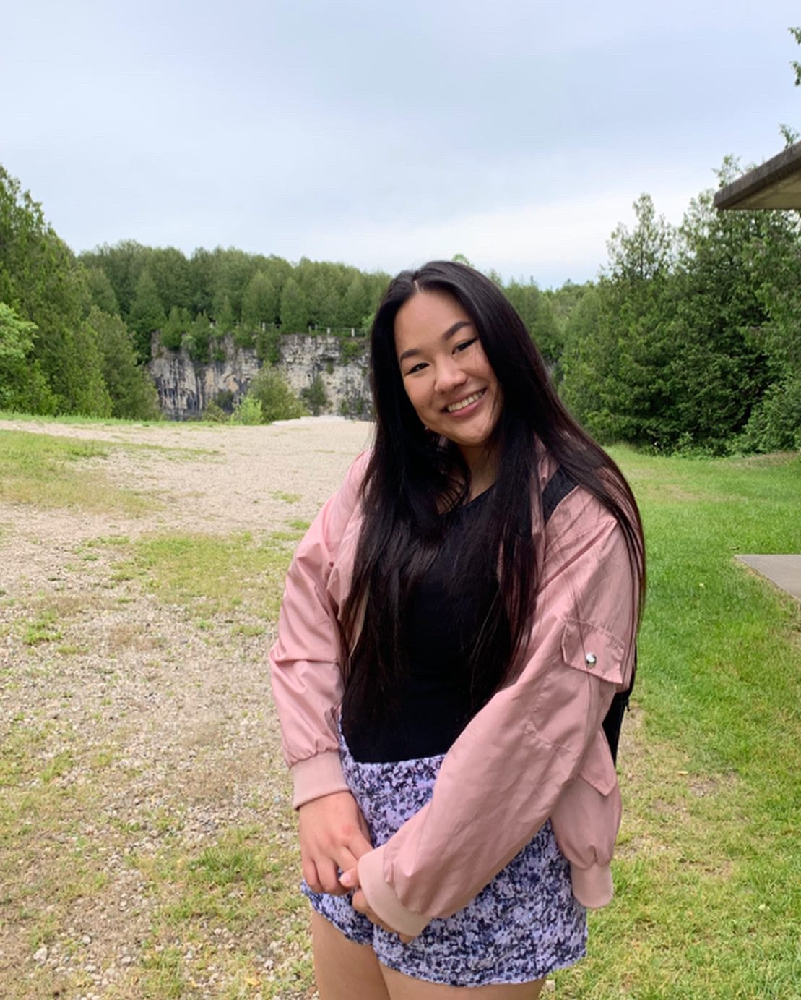

{width=250px}

Hello! My name is Lise. I was born in Montreal and grew up in Irvine, California. I'm so excited to embark on this data science journey. I am passionate about animal welfare and have fostered over 60 cats for the Montreal SPCA. I'm a novice baker, a book-lover, and tennis veteran. 

As I navigate the frigid waters of Github repos and the dark chasms of terminal windows, I hope to end block 1 with the confidence to diagnose and troubleshoot programming and development environment problems, and be able to articulate how such problems can be avoided. 

To learn more about Quarto websites visit <https://quarto.org/docs/websites>.
