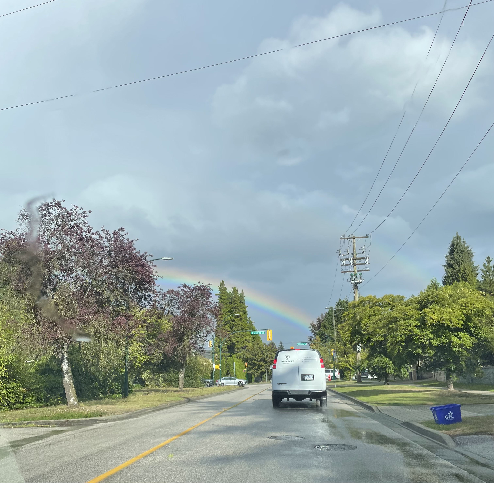

Week 1 ✅

My first day of orientation was a whirlwind of both excitement and nervousness. Sitting down at my assigned table, I found myself between two people who'd previously worked as software engineers — and immediately felt like a small fish in a very big pond. Between program deliverables, course schedules, and constant reminders about how fast-paced this program is, I could feel the gears in my mind working overtime just to keep up.

The first week of classes didn't slow things down much. DSCI 523 (R Programming) and DSCI 511 (Python Programming) felt manageable, but I hit a wall with the statistics and GitHub components of 521 — the last time I'd properly touched statistics was AP Stats my senior year of high school, back in 2018. I've since learned that undergrad biostatistics from six years ago doesn't count for as much as I'd hoped.

What surprised me most wasn't the workload itself, but how fast my confidence eroded once I actually sat down to do the work — labs and worksheets that felt straightforward in lecture took me right up to the deadline. Between the pace and the constant reminders to also rest and take care of myself, week one has been a genuine exercise in learning to stay afloat.